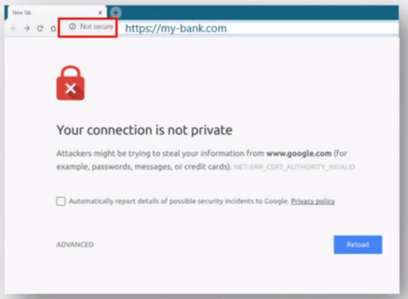
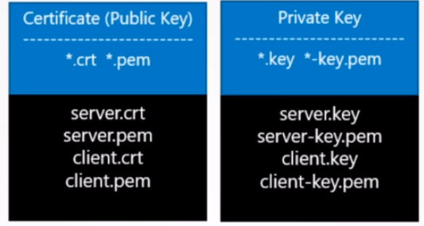

# Services

Services enable communication between various components both within and outside of the application. Help connect apps together with other apps or connect with users.


## Types

- NodePort

  - makes internal pod port accessible from the node port

- ClusterIP

  - creates  a virtual IP inside the cluster to enable communication between different services 

    - > Communication between frontend and backend apps

- LoadBalancer

  - load balancer for application in supported cloud providers

    - > E. g. to distribute load across the different web servers in your frontend tier.

### NodePort


**NodePort Service** is a Kubernetes object which listens on the port of the node and forwards requests from that port to pod port. This type of service is known as NodePort.

Maps a port on the node to a port on the pod.


Each service has its cluster IP and **Port** (2)

**NodePorts** (3) can be from 30000 to 32767

**Target por**t (1) is the port on the pod (visible to the user).

> Yes, lots of iptables in implementation

One service can have matching labels for multiple pods. In this case it balances the load with randomly.


Of course the service works on multiple nodes.


### Cluster IP


You have a set for each tier of the app. All of the pods must communicate with each other. But pod addresses are not static, pods are dying, recreating with new ip etc.

So what is the good way to do it?


Each service gets an IP (Cluster IP - unique cluster scope IP address).

### LoadBalancer

 NodePort just translates Node port to the Pod port, but we still need to know IP of a node.


This is not what users want. They want a single url accessible from the Internet.

You can just put new VM with load balancing software and configure it, but on the Cloud Supported platform you can use native Kubernetes load balancer.

## Namespaces

In Kubernetes, *namespaces* provides a mechanism for isolating groups of resources within a single cluster. Names of resources need to be unique within a namespace, but not across namespaces. Namespace-based scoping is applicable only for namespaced objects *(e.g. Deployments, Services, etc)* and not for cluster-wide objects *(e.g. StorageClass, Nodes, PersistentVolumes, etc)*.

> For example you might want to divide cluster resources between `prod` and `dev`, and to be sure that  while working in `dev` you don't accidentally modify `prod` resources.

Each of namespaces can have its own set of policies deciding who can do what and you can also assing **quota** of resources to a namespace so each namespace is guaranteed a certain amount of resources, but can't use more that its allowed limit.

**DNS**

Inside a namespace objects can to refer to each other by they "*firstname*s"

```sh
mysql.connect("db-service")
```

But to a object outside the namespace you need to use fully qualified name.

```
mysql.connect("db-service.namespace-name.svc.cluster.local")
```

**default namespaces**

Kubernetes within installation creates 3 namepsaces: default, kube-system, kube-public. When you run `kubectl get pods` or any command it happens for `default` namespace. You can specify the target namespace with `--namespace <name>` option.

> You can specify namespace in pod definition file in `metadata` section.

If you don't want to specify namespace in option each time you can switch context

```sh
kubectl config set-context $(kubectl config current context) --namespace=<name>
```

**resource quota**

To specify (limit, guarantee) resources in the namespace create resource quota.

# Imperative vs Declarative


# Annotations

In metadata section, the one when you add labels you can add non-identifying* data just describing the object. This data is annotations. You can put there app author, build version, help desk email etc.

https://kubernetes.io/docs/concepts/overview/working-with-objects/annotations/

> *In contrary to labels which are used to identify things.

# Scheduling

## Taints and tolerations

**Analogy**

We have a big farm of potatoes. As you know farmers need to fight with some species of worms. In order to make potatoes not edible by the worms they use some kind of spray (taint in k8s), so the smell will fright off some evil species of worms. We say that these species are **intolerant** to this **taint**. 

On the other hand some species of worms are good for our potatoes and we don't want to fright off them. In order to do that we use taint for which smell these species are **tolerant**.

Take on mind that on our farm we can have multiple kinds of potatoes and we can spray each kind with different **taint**, resulting in different set of worms that are **tolerant** and **intolerant**.

**Kubernetes**

In K8S Taints and Tolerations are used to set restriction on what pods can be scheduled on a node. 

>  So we just spray out nodes with some taint :D

**Example**

Lets say we have 3 worker nodes and 4 pods. By default kube-scheduler balances the pods equally.

But lets say we have a dedicated resources on workerNode1 for our frontend app. 

We can spray our WorkerNode1 with taint. Lets say the `blue`taint.

By default pods are intolerant, so none of the pods can be placed on `blue` sprayed node as no one on them have tolerance for `Taint=blue`.

Now we just need to make our desired pod with frontend app to be tolerant to blue.

**Remember**

This mechanism is only to restrict. It will not guarantee you that pod tolerant to some taint will be always placed on the node tainted with it. 

It does not tell the pod where to go, it just tells node which pods accept.

If your goal is to restrict pods to certain nodes it is achieved through *Affinity* mechanism.

**Master node**

K8s in default setup taints master node, so by default no non-kube-system pod can be placed on master node.

It is a good practice not to load master node with any worker pods 

## Node Selectors

You can label nodes and then use this labels in pod-definition file so kube-sched will read them and use.

>For example you have 1 large PC (node01) and two small PCs and you want your pod to be on the large PC.
>
>```sh
>kubectl label nodes node01 size=large
>```
>
>And then in pod definition in `spec`
>
>```yaml
>nodeSelector:
>  size: large
>```

More complex requirements you can achieve with affinity concept.

## Node Affinity

Node Selector are fine, but what if i want to put a pod on a large or medium node, or i want to put a pod on a not a small node?

Add in `spec` in pod definition file

```yaml
affinity:
  nodeAffinity:
    requiredDuringSchedulingIgnoreDuringExecution:
      nodeSelectorTerms:
      - matchExpressions:
        - key: size
          operator: In
          values:
          - large
          - medium
```

OR

```yaml
affinity:
  nodeAffinity:
    requiredDuringSchedulingIgnoreDuringExecution:
      nodeSelectorTerms:
      - matchExpressions:
        - key: size
          operator: NotIn
          values:
          - small
```

Check docs for more `operator` 

The long sentence is a Affinity type. Check the docs.

`required` - restricts a node for pod

`preffered` - try your best to match expression and if there are no nodes place it where you want

`DuringExecution` vs. `DuringScheduling` tells what happens with running pods.

## Taints and Tolerations & Node Affinity

You can combine these two mechanisms to reach your goal.

- Use Node Affinity in POD to restrict some nodes 
- Use Taints and Tolerations to in NODE restrict some pods 

## Resources

By default kube-scheduler assumes pod requests at least:

- 0.5 cpu
- 256 Mi RAM

But you can change this values in pod-definition file in `spec.containers`

```yaml
resources:
  requests:
    memory: "1Gi"
    cpu: 1
```

By default kubernets limits resources for pod with:

- 1 cpu
- 512 Mi RAM

But you can change the limits in pod-definition in `spec.containers`

```yaml
resources:
  limits:
    memory: "2Gi"
    cpu: 2
```

## Deamon sets

The deamon set ensures that one copy of the pod is always present in all nodes in the cluster.

> Use case is a monitoring agent or a log agent.
>
> K8s uses `kube-proxy` as a deamon set

The deamonset definition file resembles the replicaset definition file.

> Replica set ensures certain amount of pods will be in the cluster, while deamon set ensures one copy of certain pod per node

## Static pods

On your host where you have a container-engine (Docker) you can install only `kubelet` no Kubernetes cluster at all.

And you can specify some path for the `kubelet` when you can put pod-definition files and kubelet will take care of ensuring that one pod per file always exists.


> You cannot create replicasets, services etc. this way. Remember that `kubelet` works only on pod level and this is the only object it understands.

The pods created this way are called static.

Of course you cannot use `kubectl` to get the running pods. `kubectl` works by `kube-apiserver` which is not installed. Use just `docker ps`.

**but**

But if you will join this host as a node to a k8s cluster the pods will be visible by k8s (visible, but not editable).

**usecase**

since static pods are not dependent on k8s control plane you can use static pod to deploy the control plane components itself :D

Thats how the `kubeadm` sets up a K8s cluster.

**vs deamon sets**


## Multiple schedulers

K8s is highly extensible and you can have your own scheduler with custom checks in it. You can write own scheduler, package it and deploy in your cluster as default or additional scheduler.

Scheduler have its names and in pod-defitnion you can specify scheduler for pod.

# Logging and monitoring

## Cluster components

There is a Metrics Server in K8s which stores in-memory (not on disk) metrics about nodes, pods etc.

Metrics like consumed RAM, cpus etc.

`kubelet` (which is on each node) has component `cAdvisor` which is responsible for retrieving performance metrics from pods.

You can install Metrics Server with minikube or you can get opensource metrics systems (Prometheus, ElasticSearch etc.) from gihub and deploy them with `kubectl apply -f`


After you have any metrics system you can use for example `kubectl top node` to show nodes performance or `kubectl top pod`

## Pods

```
kubectl logs -f <pod-name>
```

If pod has multiple containers you will need to specify the container name.

# App lifecycle

### Rollout and versioning

When you create a deployment it triggers a **rollout**. A new rollout creates **deployment revision**.

When the container version is upgraded a new rollout is triggered (and new revision with it).

This tracks changes in version and enables to go back to previous revision if necessary.

```
kubectl rollout status <deployment-name>
```

```sh
kubectl rollout history <deployment-name>
```

### Deployment strategies

Lets say you have replicaset of your app. First strategy is to destroy all pods, and then run new ones with new version. The problem is that for some time app is unaccesible for users. This is called **Recreation stratey** and it is not default and recommended.

The second one is to bring down pods and run new (with newer versions) one by one. App is newer down it is called **Rolling update** and this is the default deployment strategy.

 To trgier a new rollout you just modify deployment-definition file and execute `kubectl apply -f`

The second (imperative) way is to run `kubectl update image` on deployment

### Rollback an update

```sh
kubectl rollout undo <deployment-name>
```

K8s will destroy pods in the new replicaset and run the ones from old replicaset.

## Configuring apps

### Docker 

Remeber that container lives as long as a task/process in it is not done. Containers unlike VM are not meant to host an operating system.

Thats why when you run pure OS image it will stop in a seconds. `docker run ubuntu`

Thats also why container stops after app in it crashes.

The `CMD` command in dockerfile defines the task/process that runs in a container

> In ubuntu image the CMD is `bash`. bash is a shell which listens to commands from terminal, and if it finds none it just exits.

You can override the CMD from dockerfile during run command.

```sh
docker run ubuntu sleep 5
```

> This will stop container after 5 seconds.

To make this permanent you can do your own Dockerfile with CMD

```dockerfile
FROM ubuntu
CMD sleep 5
```

```sh
docker build -t ubuntu-sleeper .
```

But the `5` is hardcoded, how to make the container parametrizable. So we can use something like

```sh
docker run ubuntu-sleeper 10
```

And thats where **Entrypoint** command comes into play.

```dockerfile
FROM ubuntu
ENTRYPOINT ["sleep"]
```

And whatever you specify in run after image name will be appended into entrypoint :smile:

Thats the difference between CMD and ENTRYPOINT.

But how to specify the default value passed to entrypoint? That way:

```dockerfile
FROM ubuntu
ENTRYPOINT ["sleep"]
CMD ["5"]
```

**overriding entrypoint**

But what if you really want to override entrypoint command?

```sh
docker run  ubuntu-sleeper 10 --entrypoint sleep2.0
```

In the next chapter we will cover how to do this in Kubernetes.

### K8s

Let's create pod definition file from image created in last chapter.

```yaml
apiVersion: v1
kind: Pod
metadata:
  name: ubuntu-sleeper-pod
spec:
  containers:
  - name: ubuntu-sleeper
    image: ubuntu-sleeper
```

How pass an argument  to `docker run` in pod-definition file? This way:

```yaml
apiVersion: v1
kind: Pod
metadata:
  name: ubuntu-sleeper-pod
spec:
  containers:
  - name: ubuntu-sleeper
    image: ubuntu-sleeper
    args: ["10"]
```

but hot to override ENTRYPOINT?

```yaml
apiVersion: v1
kind: Pod
metadata:
  name: ubuntu-sleeper-pod
spec:
  containers:
  - name: ubuntu-sleeper
    image: ubuntu-sleeper
    command: ["sleep2.0"]
    args: ["10"]
```


### Environment variables

```sh
docker run simple-web-app -e APP_COLOR=pink, APP_MODE=prod
```

In K8s:

```yaml
apiVersion: v1
kind: Pod
metadata:
  name: simple-web-app-pod
spec:
  containers:
  - name: simple-web-app
    image: simple-web-app
    env: 
      - name: APP_COLOR
        value: pink
      - name: APP_MODE
        value: prod
```

### Config maps

These are files to specify app configuration. It helps a lot if you have tons of configuration possible.

ConfigMap file:

```yaml
apiVersion: v1
kind: Config
metadata:
	name: simple-web-app-config-1
data:
APP_COLOR: pink
APP_MODE: prod
```

Pod defitniion file:

```yaml
apiVersion: v1
kind: Pod
metadata:
  name: simple-web-app-pod
spec:
  containers:
  - name: simple-web-app
    image: simple-web-app
    envFrom: 
    - configMapRef:
        name: simple-web-app-config-1
```

```sh
kubectl get configmaps
kubect describe configmap <name>
```

### Secrets

Lets say you have an app that connects to the database. It would be stupid to have user and password hardcoded. But it would be stupid to store password in a plain text like config map does it.

**Secret** is just a config map but values are hashed. In files you just write `secret` instead of `configMap`

## Scaling apps

### Multicontainer pods

Microservices help you build scalable apps where app is built from independent, one-purpose services. 

But sometimes you need a pod with two containers in it, that share the same lifecycle. For example a pod with web-server and log-agent linked to it. 

Containers in the same pod share the same network space (so they refer to each other as localhost), the same file system (storage volumes). This way you don't need to establish volume sharing or services between apps.

To run a multicontainer pod just add new containers into `containers` array in `specs` of pod-definition file.

### Initcontainers

In multicontainer pod each container is expected to run a process all the time along with its compan. When one process dies it kills the whole pod.

But somethimes we may have a uses when we need additional container in a pod that does some job and then exits. For example it can host a process that pulls a code from remote repository compiles it, stores binaries in volume and says goodbye. Then the second (main) container use these binaries to run his processes and lives as long as possible.

Here the **initContainer** comes to play. These container are meant just to do some work at the start of a pod and say goobye.

```yaml
apiVersion: v1
kind: Pod
metadata:
  name: myapp-pod
  labels:
    app: myapp
spec:
  containers:
  - name: myapp-container
    image: busybox:1.28
    command: ['sh', '-c', 'echo The app is running! && sleep 3600']
  initContainers:
  - name: init-myservice
    image: busybox
    command: ['sh', '-c', 'git clone <some-repository-that-will-be-used-by-application> ; done;']
```

If multiple initContainers are defined K8s will run them sequentially. If any one of them fails K8s will restart the pod repeatedly until the initContainer succeeds.

### Self healing apps

K8s supports self-healing apps through ReplicaSets. RepicaSet just ensure that certain amount of pod copies will run within the cluster.

K8s also provides additional support to check the health of application running in pods and take necessary actions through Liveness and Readiness probes. But this topic is for developers, not K8s Admins :((.

# Cluster maintenance

## OS upgrades

Scenario when you need to take down one of your node for example to upgrade OS on it.

When one of nodes goes down (along with pods in them) kubernetes waits for 5 mins. After 5 mins K8s sees pods from that node as dead and recreates them on the other nodes (if replicaset was applied). This 5 mins are called **pod eviction timeout**.

With that in mind if you just need to reboot your node or any other action that takes less than 5 mins, you can do it without any additional steps. After reboot K8s will fire node assigned pods again. 

But if you are not sure about time reboot takes you should do it more safe way. You can **drain** the node, which moves its pods to another nodes and the node is marked as unscheduleable. Durint this node state, you can reboot your node. When it comes back it is you need to **uncordon** it to be schedulable again. But remember the previous pods don't autotically fall back on previous node (there is no  info in K8s to do so).

Since you know drain and uncordn there is third one - **cordon**. It just makes node unschedulable, but do not remove pods from it.

## K8s versions

```sh
kubectl get nodes
```

You can see the k8s version under version column. 

>  Note that each node can have different version installed
>
> kube-apiserver get output of `kubectl get nodes` from `kubelet`s on each node, you you won't see master node if you've chosen not to install it on master node.

K8s follows standard software versioning .


ETCD and CoreDNS have different versions as these are separate projects.

## Backup and restore

Backup candidates:

- Resource configuration (pods, replicasets etc., done by declarative approach)
- etcd
- persistent volumes

### Resources

Declarative is very easy to backup, you can even github with your team etc. But what if someone anyway without sticking to standards creates something with the imperative way? 

Good way is to query kube-api-server for every object living in cluster. It is done by

```sh
kubectl get all --all-namespaces -o yaml > all.yaml
```

 But it will not be everything anyway. And of course there are solutions that already exist - Velero for example.

### etcd

It stores info about the state of the cluster - the cluster itself, nodes, and every resource living inside it. So instead of backing resources itself maybe better to just backup etcd. Etcd comes with snapshots solution.

Later you can stop your kube-api-server, restore etcd from backupsnapshot and restart the kube-api-server.

### Summary

So there are two ways of doing backup

- one by querying kube-api-server
- second by snapshoting etcd

# Security

## Security primitives

Lets begin with the cluster hosts. Of course access to this host must be secured, root access disabled, password based auth disabled, and only SSH key based auth available. Additionally any other measures to secure physical/virtual infra needs to be done. But *we will focus on Kubernetes security* itself.

**kube-api-server**

As you know api-server is center point of all operation on K8s cluster. We access it by `kucetl` or by accessing api directly and thorugh that you can perform almost any operation on the cluster, so securing api-server is important.

We need to make two types of decisions:

- Who can access it
- What can they do

**authentication**

Who can access is done by authentication mechanism. 

There are different ways you can auth into api-server:

- Username and password stored in static files
- Username and tokens stored in static files
- Certifates 
- External auth providers (LDAP etc.)
- Service Account - for machines, not people

**authorization**

What can they do is done by authorization mechanism

In api-server it is implemented by

- RBAC (Role Based Access Control). Users are associated yo groups with specific permissions.

- ABAC (Attribute Based access Control)
- Node Authorization
- Webhook mode

**TLS certificates**


Each communication between control plane elements or node-runnig kubelet, kube-proxy and kube-apiserver is secured using TLS encryption.

**Network policies**

By default all the cluster pods can access all other pods withing the cluster. You can restrict access between then using Network Policies.

## Authentication

There are various users that are accessing cluster:

- Admins
- Developers
- Bots (Other programs, processes, service that require access to cluster (e.g. for integration purposes))

> Security of end users accesing apps deployed on the cluster is managed on the application themselves internally.

K8s does not manage user accounts it relies on external sources (files, certificates, ldap etc.) 

>  So you can't create user accounts in K8s (but you can create service accounts)

*we will focus on human access (admin and developers)*

All user access is managed by kube-api-server


kube-apiserver first authenticates user before processing the request.

**Files authentication**

To implement file authentication you just simply create `.csv` file with columns `password, username, userId` and pass the file name as an option to kube-apiserver `--basic-auth-file=user-details.csv` or if you are using `kubeadm` tool passs this as command to kube-apiserver pod definition file and and kubeadm will restart while you update the file.

To implement file with tokens do the same but option is called `token-auth-file=<filename>`

And in HTTP request you will need to add auth header with value "Bearer: <token>".

> It is the most insecure method (passwords in plain text xD)

## TLS Certificates

Is used to guarantee trust between two parts in a transaction. Certificate assures that communication between user and the server is encrypted and the server is who it says it is.

Without encryption User Credentials would be sent with plain text and hackers can easily sniff them. 

To encrypt something we use keys.

A key is a set of random numbers. When you add key and mix with data you credentials cannot be recognized. Sniffers cannot do anything with it.

However the server cannot encrypt the data without the key. We can send key with our data, and it is called **Symmetric encryption**. Note that key is sent through the same network so it can be sniffed. If Hacker knows the encryption format he can decrypt the data anyway. And thats where **Asymmetric encryption** comes in.

Instead of using the same key to encrypt and decrypt the data. We have a private key and public key. The public key works kind of like a lock more.

Public key can only lock something, but cannot unlock it. It can only be unclocked by matching private key.

 You can generate private and public keys with

```sh
$ ssh-keygen
$ ls
id_rsa id_rsa.pub
```

which creates two files.

Then you can secure your server by locking down all access to it, except through a door that is locked using your public key. You can do that by having a file with authorized keys

```sh
cat ~/.ssh/authorized_keys
FSFSDFSDFfsffsdafsfsaff.sopadfmsdalf,2930rfhuwq
fdsanfuibnfg9ie3qnh980hfasdmoifknUIJFSJFFSJFUIS
...
```

Private key is only always with you on your laptop.

If you want to ssh you need to specify your private key location:

```sh
ssh -i id_rsa user1@server1
```

> If you want next user to have access to server, he can generate his pair of keys and you can insert his public key to the `authorized_keys` file

### Assymetric encryption

With **public key** you can encrypt some data, and with matching **private key** you can decrypt it.

So how to transfer symmetric key over the network with usage of asymmetric encryption, so hacker cannot decrypt data?


The goal is to user and server use symmetric encryption.

0. Users creates the symmetric key

1. Create key pair on a server

   ```sh
   openssl genrsa -out my-bank.key 1024
   ```

2. When user access the Web server first time using `https` he gets the public key from the server

   1. Sniffer also gets a copy of public key.

3. Now the user uses public key from server to encrypt his symmetric key.

4. User sends encrypted symmetric key to the server

   1. Sniffer gets this message but has no private key to decrypt it

5. Server uses the private key to decrypt the message and obtain symmetric key from user

6. Now both user and server has symmetric key and can encrypt with it the data

   1. Hacker does not have the symmetric key (only a encrypted message with it inside) to decrypt the sniffed data


 

### New hacker ways

The only way now the hackey can get you credentials is to you send him it in a plain text. So he creates an exactly the same looking website. Then hacker hosts the website on his own server and he want you to think its secure so he also generates pair of keys etc..

And finally somehow he manages to feed you with his server address, or routes your request to his server. Form now on everything goes as on the example above but this is not the bank server !!!

How to resolve this?

What if you can look  at the public key (the one generated on server) you receive and examine if it is a legitimate key from a real bank server.

So actually server does not send the key alone. It sends the certificate that has a key inside. Certificate says who is the server owner, the server location etc.


But anyone can generate certificate like this. So how do you look if a certificate is legit?

So the most important part is **who signed the certificate**. If you create a cerificate it will be signed by you and no web browser will trust you.



So how then you get a sign from someone trusted?


CAs are well known organisations tha can sign and validate certificates for you.

So if you want to have legitimate website you generate CSR - Certificate Signing Request using the public key you generated. The CA verify you and once it checks out the sign the ceritificate and send it back. Now webbrowsers will trust your server.

If a hacker want to sign a certificate his CSR will be rejected and web-browsers will not trust his servers.


But how browsers know which CA are valid? Or if a certificate was signed by Symantec how to know if this is real Symantec?

Well .. CAs have they own pair of keys. Private for signing certificates, and public which built into the browsers. The browsers uses the public key of a CA to validate if certificate is signed by valid CA.

### Private certificates

But browser has only public figures like banks, emails, etc.. however browsers does not help you validate sites hosted privately e.g. in your organization e.g. for accessing internail email or newsletter.

Most of CAs have a private offering of their services. You can then have your public key of server installed on all your employees browsers.

### PKI - Public Key Infrastructure

This whole infrastructure including the CIA, the servers, the people, keys and generatring, distributing and maintaning difital certificates is known as **Public Key Infrastructure** 

### Note on the keys

We have two keys:

- public
- private

If ENcrypt data with one, the you cannot do it with the second. Soo be careful.

Keys are two related, paired keys. You can ENCRYPT data with one of them and DECRYPT data only with the other. You cannot encrypt and decrypt with the same key.

### Note on naming

Public Keys (certificates) are usually named with `.crt` or  `.pem`

Private keys are usually named with `.key`  or `-key.pem`



## TLS in Kubernetes

So we now now, that the CAs has certificates knows as **root certificates**, a server has certificates called **server certificates**, and server can request certificates from client - **client certificates**.

Kubernetes cluster has a set of nodes (master and worker nodes). All communication between these nodes needs to be secured and encrypted. For example admin with kube-api-server must establish a TLS connection same as communication between all components in cluster.

So we need Server certificates for servers and client certificates for clients in cluster.

Servers:

- kube-api 
  - apiserver.crt, apiserver.key
- etcd server
  - etcsserver.crt, etcdserver.key
- kubelet 
  - kubelet.crt, kubelet.key

Clients:

 - admin via kubectl  ---> kube-api-server
   - admin.crt, admin.key
 - kube-scheduler   ---> kube-api-server
   - scheduler.crt, scheduler.key  
 - kube-controller-manager ---> kube-api-server
   - controller-manager.crt, controller-manager.key
 - kube-proxy ---> kube-api-server
   - kube-proxy.crt, kube-proxy.key

> kube-api server is the only component that talks to etcd-server

- kube-api ---> etcd server
  - it can use the same pair of keys as it used for being server
- kube-api ---> kubelet
  - it can use the same pair of keys or generate new ones


That is a lot of certificates, lets group them


And also remember we need a CA to sign these certificates.

K8s requires you to have at least 1 certificate.

## Create a cert for cluster

Tools:

- easyrsa
- openssl
- cfssl

we will use `openssl`

### Create CA:

****

Create a key

```sh
openssl genrsa 	-out ca.key 2048
```

create Certificate Signing Request

```sh
openssl req -new -key ca.key -subj "/CN=KUBERNETES-CA" -out ca.csr
```

`-subj` tells for what we are requesting the cert

sign the certificate

```sh
openssl x509 -req -in ca.csr -signkey ca.key -out ca.crt
```

Now we have our certificate


 ### Create client certs

Generate admin key

```sh
openssl genrsa -out admin.key 2048
```

create Certificate Signing Request

```sh
openssl req -new -key admin.key -subj "/CN=kube-admin/O=system:masters" -out admin.csr
```

sign with previous created ca key pair

```sh
openssl x509 -req -in admin.csr -CA ca.csr -CAkey ca.key -out admin.crt
```

Now generate certs for other clients.

#### How to use generated admin cert?

Now instead of login and password you can use the certificate to authorize

```sh
curl https://kube-apiserver:6443//api//v1//pods --key admin.key --cert admin.crt --cacert ca.crt
```

#### Note on clients

Remember that in Inernet web browsers has certs from CA built in. So you will need to manually do the same thing in your cluster - distribute you `ca.crt` through the nodes.

### Create server certs

//TODO i will not use certs in my kubernetes so...

## Authorization

learn about `can-i` command

## Network Policies

Network policy applies to a pod and it says "Only allow a network traffic from a pod XX on port YY".

> Use case would be to block direct communication between db pod and frontend app pod. To do this you can tell db to allow only network traffic from `backend pod` on port `3306`.
>
> > 3306 - my sql default port

By default all pods in cluster are connected via the virtual netwrok with policy `AllowAll`.

Ingress - icoming traffic

Egress - outcoming traffic

If you allow incoming traffic on some port, responses made for requests on this port will be allowed automatically.

With network policies you not only restrict traffic from pods but even ip adresses (`ipBlock`).
